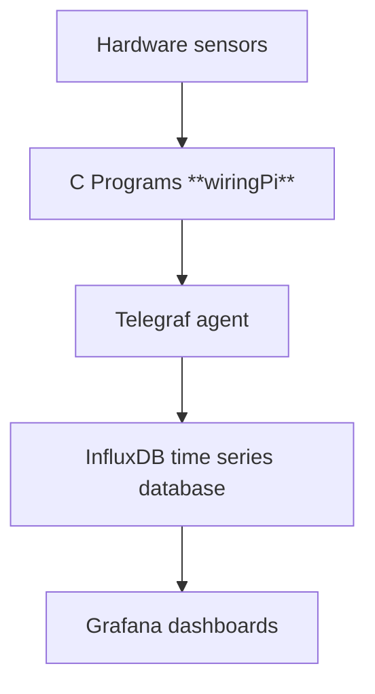
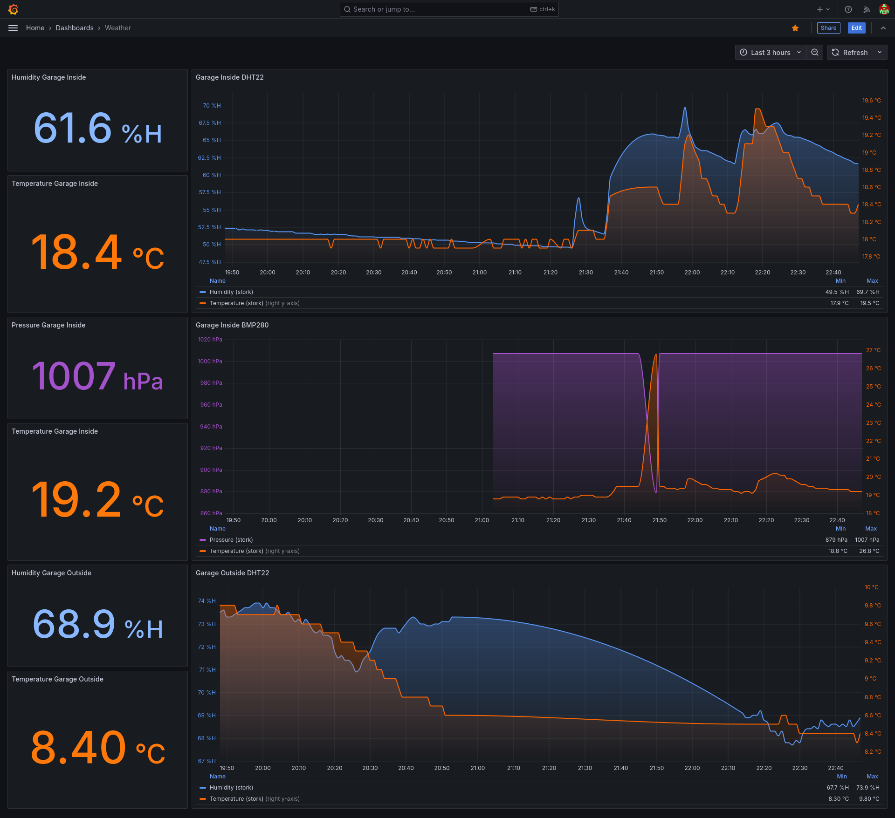

# Raspberry Pi Weather Monitoring System

This project showcases a weather monitoring system using Raspberry Pi 2 with DHT11/DHT22 and AHT20/BMP280 sensors. The collected data is displayed in Grafana through InfluxDB for real-time weather visualization.

## Features

1. **Sensor Data Collection**:
   - Reads data from DHT11/DHT22 and AHT20/BMP280 sensors using C programs and the **wiringPi** library.
   - Supports indoor (garage) and outdoor data collection.

2. **Line Protocol Integration**:
   - Outputs data in InfluxDB's line protocol format, making it compatible with Telegraf for seamless ingestion.

3. **Time-Series Data Storage**:
   - Utilizes InfluxDB for storing time-series weather data.

4. **Visualization with Grafana**:
   - Displays real-time weather dashboards using InfluxDB as a data source.

---

## System Requirements

- **Hardware**:
  - Raspberry Pi with GPIO pins
  - DHT11 or DHT22 sensor
  - AHT20 or BMP280 sensor

- **Software**:
  - wiringPi C library
  - Telegraf
  - InfluxDB
  - Grafana

---

## Getting Started

### 1. Compiling the C Programs

Ensure that the **wiringPi** library is installed before compiling.

Run the following commands to compile the sensor scripts:

```sh
gcc aht20+bmp280.c -o aht20+bmp280 -l wiringPi
gcc dht11+22.c -o dht11+22 -l wiringPi
```

### 2. Configuring Telegraf

Set up Telegraf to collect sensor data and send it to InfluxDB. Below is an example configuration:

```toml
[[inputs.exec]]
   commands = [
     "/etc/telegraf/scripts/dht11+22 -dhtpin 15 -sensor dht22",
     "/etc/telegraf/scripts/dht11+22 -dhtpin 3 -sensor dht22",
     "/etc/telegraf/scripts/aht20+bmp280 -sensor bmp280"
   ]
   timeout = "30s"
   data_format = "influx"
```

Refer to the official documentation for setting up Telegraf and InfluxDB:

- [InfluxDB Documentation](https://docs.influxdata.com/influxdb/v2/)
- [Telegraf Documentation](https://docs.influxdata.com/telegraf/v1/)

### 3. Configuring Grafana

1. In Grafana, go to **Dashboards** > **New** > **Import Dashboard**.
2. Import the dashboard JSON file provided in the project directory.
3. Connect Grafana to your InfluxDB instance as a data source.

---

## Project Architecture



1. **Sensors**: DHT11/DHT22 and AHT20/BMP280 measure temperature, humidity, and pressure.
2. **C Programs**: Fetch data from sensors and format it for Telegraf.
3. **Telegraf**: Collects and sends data to InfluxDB.
4. **InfluxDB**: Stores time-series weather data.
5. **Grafana**: Visualizes the data on a customizable dashboard.

---

## Example Output

Here is an example of the data output in InfluxDB's line protocol format:

```text
Weather,host=stork,pinnum=15,sensor_type_name=dht22 humidity=72.9,temperature=10.0
Weather,host=stork,pinnum=3,sensor_type_name=dht22 humidity=51.1,temperature=17.2
Weather,host=stork,sensor_type_name=bmp280 pressure=1009,temperature=18.4
```

---

## Screenshot

Below is a screenshot of the Grafana dashboard showing the final visualization:



---

## Future Improvements

- Add support for additional sensors.

---

## License

This project is licensed under the [Apache License](LICENSE).

---

## Contributions

Contributions are welcome! Please feel free to submit pull requests or file issues for improvements.

---

## Acknowledgments

- [wiringPi Library](https://github.com/WiringPi/WiringPi)
- [InfluxData](https://www.influxdata.com/)
- [Grafana](https://grafana.com/)
