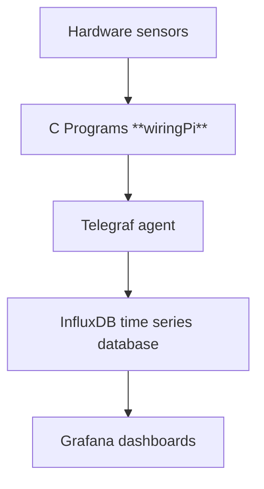

# Raspberry Pi Weather Monitoring System

This project showcases a weather monitoring system using Raspberry Pi with DHT11/DHT22, DS18B20 and AHT20/BMP280 sensors. The collected data is displayed in Grafana through InfluxDB for real-time weather visualization.

## Features

1. **Sensor Data Collection**:
   - Reads data from DHT11/DHT22 and DS18B20, and AHT20/BMP280 sensors.
   - Sensor readers implemented as small C programs (wiringPi) and standalone utilities.
   - Supports indoor (garage) and outdoor data collection.

2. **Line Protocol Integration**:
   - Outputs data in InfluxDB's line protocol format, compatible with Telegraf.

3. **Time-Series Data Storage**:
   - Utilizes InfluxDB for storing time-series weather data.

4. **Visualization with Grafana**:
   - Displays real-time weather dashboards using InfluxDB as a data source.

---

## System Requirements

- **Hardware**:
  - Raspberry Pi with GPIO pins
  - DHT11 or DHT22 sensor
  - DS18B20 sensor
  - AHT20 or BMP280 sensor
  - (optional) 128x64 SSD1306 I2C OLED display

- **Software**:
  - wiringPi (for C sensor programs)
  - Telegraf
  - InfluxDB
  - Grafana
  - Python 3 and these packages for the OLED utility: luma.oled, Pillow, psutil

---

## Getting Started

### 1. Compiling the C Programs

Ensure that the **wiringPi** library is installed before compiling.

Run the following commands to compile the sensor scripts:

```sh
gcc aht20+bmp280.c -o aht20+bmp280 -l wiringPi
gcc dht11+22.c -o dht11+22 -l wiringPi
gcc ds18b20.c -o ds18b20
```

### 2. Configuring Telegraf

Set up Telegraf to collect sensor data and send it to InfluxDB. Example configuration:

```toml
[[inputs.exec]]
   commands = [
     "/etc/telegraf/scripts/dht11+22 -dhtpin 15 -sensor dht22",
     "/etc/telegraf/scripts/dht11+22 -dhtpin 3 -sensor dht22",
     "/etc/telegraf/scripts/aht20+bmp280 -sensor bmp280",
     "/etc/telegraf/scripts/ds18b20 -pin 4"
   ]
   timeout = "30s"
   data_format = "influx"
```

Refer to the official documentation for setting up Telegraf and InfluxDB:

- [InfluxDB Documentation](https://docs.influxdata.com/influxdb/v2/)
- [Telegraf Documentation](https://docs.influxdata.com/telegraf/v1/)

### 3. Configuring Grafana

1. In Grafana, go to **Dashboards** > **New** > **Import Dashboard**.
2. Import the dashboard JSON file provided in the project directory.
3. Connect Grafana to your InfluxDB instance as a data source.

---

## SSD1306 OLED Display Utility

A Python utility (ssd1306.py) is included to show system, network and clock screens on a 128x64 SSD1306 I2C OLED.

- Dependencies:
  - Python 3
  - luma.oled, luma.core
  - Pillow
  - psutil

Install dependencies:

```sh
python3 -m pip install luma.oled pillow psutil
```

Usage examples:

```sh
# Run dashboard (rotate screens)
python3 /home/youruser/path/to/ssd1306.py

# Show 'system' screen once and exit, leaving display as-is
python3 /home/youruser/path/to/ssd1306.py --once --screen system

# Show screen by index (0=system,1=network,2=clock) once
python3 /home/youruser/path/to/ssd1306.py --once --screen 1
```

Notes:

- Enable I2C on the Pi (raspi-config → Interfacing Options → I2C).
- Ensure the user running the program has access to /dev/i2c-1 (add to `i2c` group if needed).
- Script expects SSD1306 at I2C address 0x3C (adjust in script if different).

Running as a rootless systemd user service:

1. Place the script in a fixed path (example: /home/youruser/bin/ssd1306.py) and make it executable.
2. Create `~/.config/systemd/user/ssd1306.service` with:

```ini
[Unit]
Description=SSD1306 OLED dashboard (user service)
After=network.target

[Service]
Type=simple
ExecStart=/usr/bin/python3 /home/youruser/bin/ssd1306.py
Restart=always
Environment=PYTHONUNBUFFERED=1

[Install]
WantedBy=default.target
```

Enable and start for the user:

```sh
systemctl --user daemon-reload
systemctl --user enable --now ssd1306.service
```

To run the user service across reboots without interactive login:

```sh
sudo loginctl enable-linger youruser
```

Ensure the user has permissions for I2C device nodes.

---

## Project Architecture



1. **Sensors**: DHT11/DHT22, DS18B20 and AHT20/BMP280 measure temperature, humidity, and pressure.
2. **C Programs**: Fetch data from sensors and format it for Telegraf.
3. **Telegraf**: Collects and sends data to InfluxDB.
4. **InfluxDB**: Stores time-series weather data.
5. **Grafana**: Visualizes the data on a customizable dashboard.

---

## Example Output

Here is an example of the data output in InfluxDB's line protocol format:

```text
Weather,host=stork,pinnum=15,sensor_type_name=dht22 humidity=72.9,temperature=10.0
Weather,host=stork,pinnum=3,sensor_type_name=dht22 humidity=51.1,temperature=17.2
Weather,host=stork,sensor_type_name=bmp280 pressure=1009,temperature=18.4
Weather,host=owl,pinnum=4,sensor_type_name=ds18b20 temperature=22.4
```

---

## Screenshot

Below is a screenshot of the Grafana dashboard showing the final visualization:


---

## Future Improvements

- Add support for more sensors and configuration options for the OLED utility.

---

## License

This project is licensed under the [Apache License](LICENSE).

---

## Contributions

Contributions are welcome! Please feel free to submit pull requests or file issues for improvements.

---

## Acknowledgments

- [wiringPi Library](https://github.com/WiringPi/WiringPi)
- [InfluxData](https://www.influxdata.com/)
- [Grafana](https://grafana.com/)
